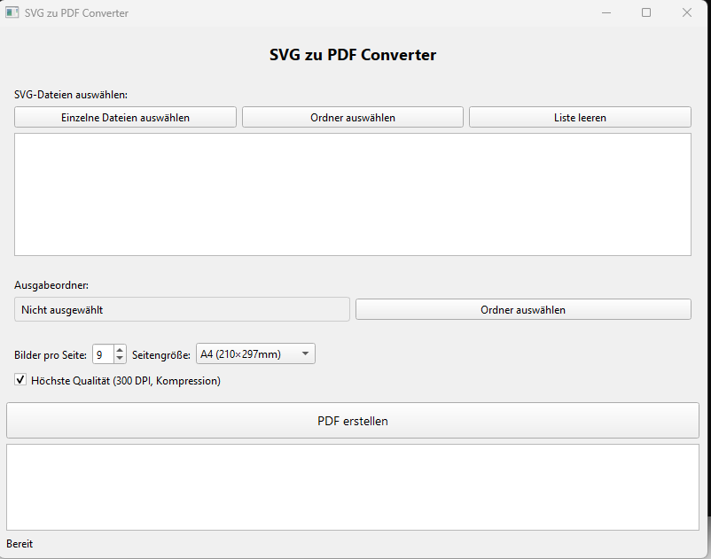

# SVG to PDF Converter




A Python application for converting multiple SVG files into a single PDF document, with support for customizable page layouts and high-quality output. Built using PyQt6, ReportLab, and svglib, it provides a user-friendly GUI for selecting files, configuring settings, and monitoring conversion progress.

## Features

- **Batch Conversion**: Convert multiple SVG files into a single PDF with a grid layout (default 3x3, up to 12 images per page).
- **Customizable Page Settings**:
  - Page sizes: A4, A3, A2, A1, A0, Letter, Legal.
  - Adjustable images per page (1 to 12).
- **Quality Options**: High-quality output (300 DPI with compression) or standard quality for smaller file sizes.
- **File Selection**:
  - Select individual SVG files or an entire folder.
  - Clear the file list for new selections.
- **Output Management**:
  - Choose an output folder or specify a PDF file name.
  - Automatic file naming with incrementing numbers to avoid overwriting.
  - Option to open the output folder after conversion.
- **Progress Monitoring**: Real-time progress bar and detailed log output for conversion status.
- **User Interface**: Clean, modern GUI with a dark theme (Fusion style) and multilingual support (German labels in the provided code).
- **Error Handling**: Detailed error logging and user notifications for conversion issues.

## Requirements

- Python 3.6+
- PyQt6
- ReportLab
- svglib
- Optional: cairosvg (for enhanced SVG rendering, though not explicitly required in the code).

Install dependencies using:

```bash
pip install PyQt6 reportlab svglib
```

## Installation

1. Clone the repository:
   ```bash
   git clone https://github.com/yourusername/svg-to-pdf-converter.git
   cd svg-to-pdf-converter
   ```

2. Install the required dependencies:
   ```bash
   pip install -r requirements.txt
   ```

3. Run the application:
   ```bash
   python image_2_pdf.py
   ```

## Usage

1. **Launch the Application**: Run the script to open the GUI.
2. **Select SVG Files**:
   - Click "Einzelne Dateien auswählen" to select individual SVG files.
   - Click "Ordner auswählen" to select a folder containing SVG files.
   - Click "Liste leeren" to clear the selected files.
3. **Choose Output Folder**:
   - Click "Ordner auswählen" to select a folder for the output PDF.
   - The output PDF will be named `converted_svgs.pdf` (or with a numbered suffix if the file exists).
4. **Configure Settings**:
   - Set terci: Set the number of images per page (default: 9).
   - Choose a page size (A4, A3, A2, A1, A0, Letter, or Legal).
   - Check "Höchste Qualität" for high-quality output (300 DPI, compression).
5. **Convert**: Click "PDF erstellen" to start the conversion process.
6. **Monitor Progress**: Watch the progress bar and log messages for real-time updates.
7. **Review Output**: After conversion, choose to open the output folder or check the generated PDF.

## File Structure

- `image_2_pdf.py`: Main application script.
- `requirements.txt`: List of required Python packages.
- No additional assets are required, as the application generates PDFs dynamically.

## Notes

- The application uses a 3x3 grid layout by default for arranging SVGs on each page.
- High-quality mode (300 DPI, compression) is enabled by default for optimal output but can be disabled for smaller file sizes.
- The GUI uses German labels (e.g., "PDF erstellen", "Höchste Qualität"), but the functionality is language-agnostic.
- The application automatically scales SVGs to fit the grid while preserving quality, with a maximum 2x scaling in high-quality mode.
- Errors during conversion (e.g., invalid SVG files) are logged in the status window and displayed in a dialog.
- The output folder can be opened directly from the application on Windows, macOS, or Linux.

## Contributing

Contributions are welcome! Please submit a pull request or open an issue for bug reports, feature requests, or improvements.

1. Fork the repository.
2. Create a new branch (`git checkout -b feature/your-feature`).
3. Commit your changes (`git commit -m "Add your feature"`).
4. Push to the branch (`git push origin feature/your-feature`).
5. Open a pull request.

## License

This project is licensed under the MIT License. See the `LICENSE` file for details.

## Acknowledgments

- Built with PyQt6 for the GUI, ReportLab for PDF generation, and svglib for SVG rendering.
- Inspired by the need for efficient batch conversion of SVG files to PDF for printing or archiving.
- Thanks to the open-source community for providing robust libraries like ReportLab and svglib.
